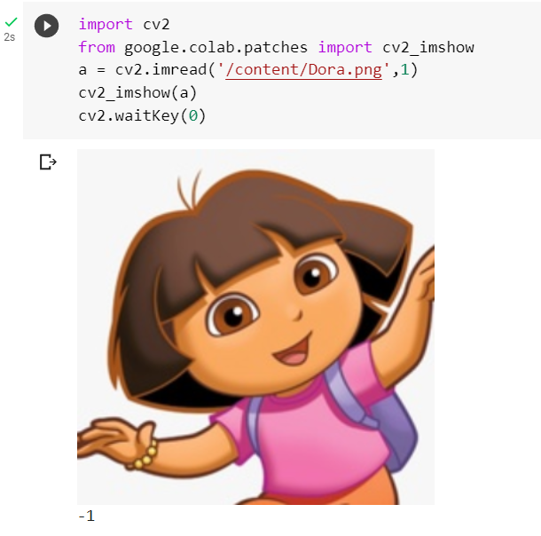
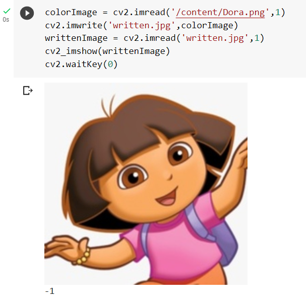
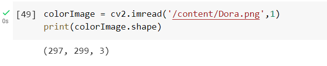
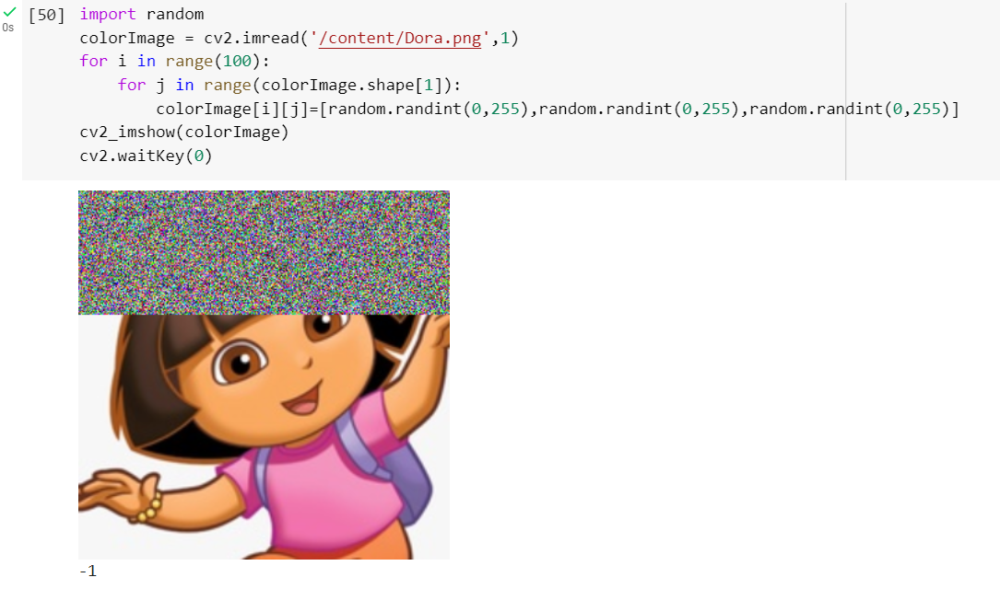
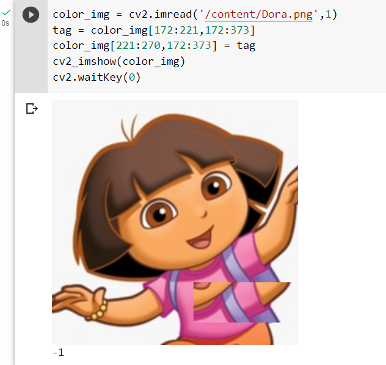

# READ AND WRITE AN IMAGE
## AIM:
To write a python program using OpenCV to do the following image manipulations.
i) Read, display, and write an image.
ii) Access the rows and columns in an image.
iii) Cut and paste a small portion of the image.

## SOFTWARE REQUIRED:
Anaconda - Python 3.7

## ALGORITHM:
### STEP 1:
Choose an image and save it as a filename.jpg
### STEP 2:
Use imread(filename, flags) to read the file.
### STEP 3:
Use imshow(window_name, image) to display the image.
### STEP 4:
Use imwrite(filename, image) to write the image.
### STEP 5:
End the program and close the output image windows.

## PROGRAM:
```
/*
Developed By: Paarkavy B
Register Number: 212221230072
*/
```

i) #To Read,display the image
```
import cv2
from google.colab.patches import cv2_imshow
a = cv2.imread('/content/Dora.png',1)
cv2_imshow(a)
cv2.waitKey(0) 
```

ii) #To write the image
```
colorImage = cv2.imread('/content/Dora.png',1)
cv2.imwrite('written.jpg',colorImage)
writtenImage = cv2.imread('written.jpg',1)
cv2_imshow(writtenImage)
cv2.waitKey(0)
```

iii) #Find the shape of the Image
```
colorImage = cv2.imread('/content/Dora.png',1)
print(colorImage.shape)
```

iv) #To access rows and columns
```
import random
colorImage = cv2.imread('/content/Dora.png',1)
for i in range(100):
    for j in range(colorImage.shape[1]):
        colorImage[i][j]=[random.randint(0,255),random.randint(0,255),random.randint(0,255)]
cv2_imshow(colorImage)
cv2.waitKey(0)
```

v) #To cut and paste portion of image
```
color_img = cv2.imread('/content/Dora.png',1)
tag = color_img[172:221,172:373]
color_img[221:270,172:373] = tag
cv2_imshow(color_img)
cv2.waitKey(0)
```

## OUTPUT:

### i) Read and display the image



### ii)Write the image



### iii)Shape of the Image



### iv)Access rows and columns



### v)Cut and paste portion of image



## RESULT:
Thus the images are read, displayed, and written successfully using the python program.


